# Kafka Core

# Topic 개요

- Topic은 여러 개의 Partition으로 구성된 일련의 **로그 파일**이다.
- Topic은 RDBMS의 Table과 유사한 기능을 수행한다.(정보 저장)
- Topic은 Key와 Value 기반의 메시지 구조이며, Value로 **어떤 타입(문자열, 숫자값, 객체, JSON, Avro, Protobuf)의 메시지도 가능**하다.
- 로그 파일과 같이 연속적으로 발생하는 데이터를 저장하는 구조이다.
- 즉, 다음과 같이 Topic은 **시간의 흐름에 따라 메시지가 순차적으로 물리적인 파일에 write** 된다.

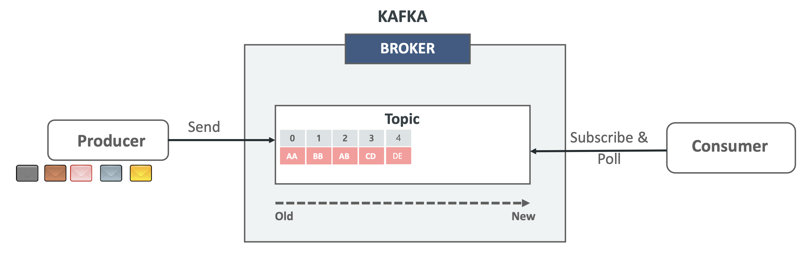

### Topic & Partition

- Topic은 **1개 이상의 파티션을 가질 수 있다.**
- Topic의 Partition은 Kafka의 **병렬 성능과 가용성의 핵심 요소**이며, 메시지는 병렬 성능과 가용성을 고려한 개별 파티션에 분산 저장된다.

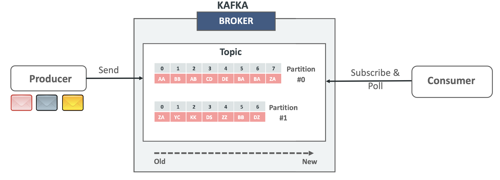

### Topic & Partition & Offset

- 개별 Partition은 **정렬**되고 **변경할 수 없는(immutable)** 일련의 Record로 구성된 **로그 메시지**이다.
- 각각의 Record는 Offset으로 불리는 일련 번호를 할당받는다.
- 각각의 Partition은 **완전히 독립적**이다.
- 각각의 Partition 내에서 **정렬**되고 Offset이 할당된다.

~[topic and partition and offset 01](./images/topic_partition_offset_01.png)

### Topic & Partition의 병렬 분산처리

- 메시지는 병렬 성능과 가용성을 고려한 방식으로 Topic내의 **각각의 Partition들에 분산 저장된다.**
- Topic의 Partition들은 **단일 카프카 브로커 뿐만아니라 여러 개의 카프카 브로커들에 분산 저장된다.**

~[topic and partition and offset 02](./images/topic_partition_offset_02.png)

- 가용성면에서는 replication-factor 파라미터를 조절해서 하나의 브로커가 다운되어도 다른 브로커를 이를 대신해서 일을 할 수 있게끔 할 수도 있다.
- 예를들어 밑에 예시와 같이 브로커 0, Partition 0의 복제본을 브로커 1이 가지고 있고, 브로커 1, Partition 1의 복제본을 브로커 0가 가지고 있는 형태가 될 것이다.
- 이런 상황에서 브로커 1이 다운되면 브로커 0가 가지고 있던 Partition 1 복제본이 Leader가 되게 된다.

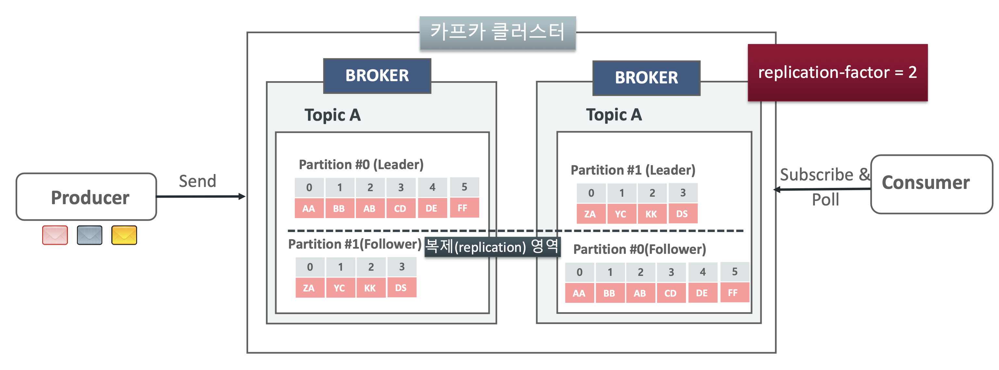

### Topic 관련 명령어

- Topic 생성

```shell
kafka-topics --bootstrap-server localhost:9092 --create --topics {토픽명}
```

- 파티션이 3개인 Topic 생성

```shell
kafka-topics --bootstrap-server localhost:9092 --create --topics {토픽명} --partitions 3
```

- 파티션이 3개고 replication-factor가 2개인 Topic 생성

```shell
kafka-topics --bootstrap-server localhost:9092 --create --topics {토픽명} --partitions 3--replication-factor 2
```

- Topic 목록 조회

```shell
kafka-topics --bootstrap-server localhost:9092 --list
```

- 특정 Topic 상세 조회

```shell
kafka-topics --bootstrap-server localhost:9092 --describe --topic {토픽명}
```

- 특정 Topic 삭제

```shell
kafka-topics --bootstrap-server localhost:9092 --delete --topic {토픽명}
```

# Producer & Consumer 개요

- Producer는 **Topic에 메시지를 보내는 역할**을 수행한다.(메시지 write)
- Producer는 **성능/로드밸런싱/가용성/업무 정합성등을 고려하여 어떤 브로커의 파티션으로 메시지를 보내야 할지 전략적으로 결정**된다.
- 다음과같이 Producer가 생성한 메시지는 크게 Topic(목적지), Partition, Key, Value, Header로 구성된다. 여기서 Topic, Value는 반드시 값이 세팅되어 있어야한다.
- Consumer는 **Topic에서 메시지를 읽어들인다.**
- 여러 개의 Consumer들로 구성될 경우 **어떤 브로커의 파티션에서 메시지를 읽어들일지 전략적으로 결정**한다.

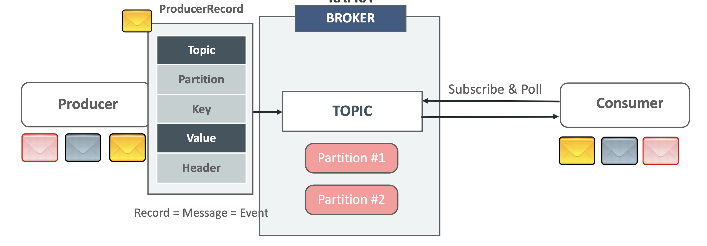

- Kafka Consumer는 poll() 메서드를 이용해서 **주기적으로 브로커의 Topic Partition에서 메시지를 가져온다.**
- 메시지를 성공적으로 가져왔으면 **commit을 통해서 __consumer_offset에 다음에 읽을 offset 위치를 기재**한다.

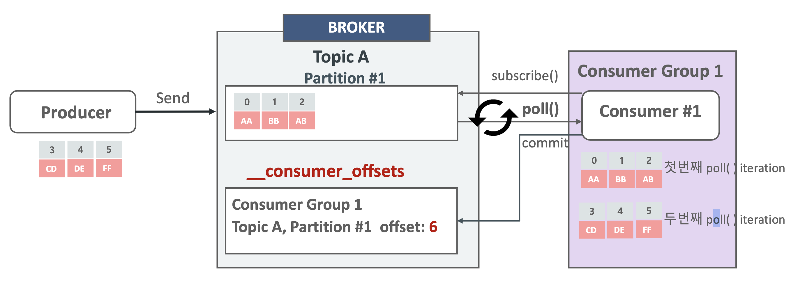

### Consumer의 auto.offset.reset

- Consumer가 Topic에 처음 접속하여 Message를 가져올 때 **가장 오래된 처음 offset 부터(earliest) 가져올 것인지, 가장 최근인 마지막 offset 부터 가져올 것인지를 설정하는 파라미터**이다.
- CLI에서 kafka-console-consumer 명령어를 사용할 때 **--from-beginning**을 사용해야만 auto.offset.reset이 earlist로 지정된다.
- auto.offset.reset에 아무옵션을 설정하지 않으면 기본값을 latest로 설정된다.

### Producer와 Consumer간의 Serialized Message 전송

- Producer가 메시지(객체)를 생성하면 우선적으로 **Serializer를 통해서 객체에 대해서 직렬화**가 이루어진다.
- Serializer는 **객체를 byte[]로 변환**하고, **네트워크상으로 byte[]를 브로커로 전송**한다.
- 브로커는 이를 받아서 Topic안의 **Partition안에 메시지를 byte[] 형태로 저장**한다.
- Consumer는 Polling을 하다가 특정 토픽에 메시지가 브로커에서 감지되면 **byte[] 그대로 받아서 deserializer를 통해서 byte[]에 대해서 역직렬화**가 이루어진다.
- 마지막으로 Consumer는 원래의 메시지(객체)를 받게된다.

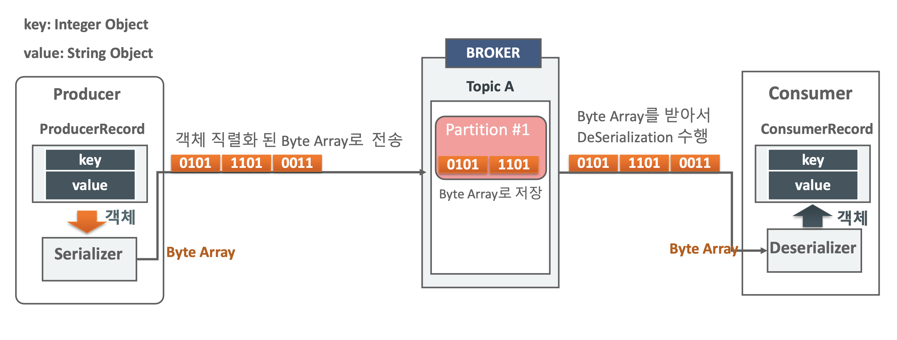

> Java Object의 Serialization이란 객체(Object)를 객체의 유형, 데이터의 포맷, 적용 시스템에 상관없이 이동/저장/복원을 자유롭게 하기 위해서 바이트 배열(바이트 스트림) 형태로 저장하는 것을 의미한다. 객체는 Serialization과 Deserialization을 통해서 서로 다른 저장영역에 이동/저장/복원을 자유롭게 수행한다.

### Key값을 가지지 않는 메시지 전송

- 메시지는 Producer를 통해 전송 시 **Partitioner를 통해서 토픽의 어떤 파티션으로 전송되어야 할 지 미리 결정**이 된다.
- Key값을 가지지 않는 경우 **라운드로빈(Round Robin), 스티키 파티션(Sticky Partition) 등의 파티션 전략 등이 선택**되어 파티션별로 메시지가 전송될 수 있다.
    - 즉, Topic이 여러 개의 파티션을 가질 때 메시지의 **전송 순서가 보장되지 않은 채**로 Consumer에서 읽혀질 수 있다.
        - 예를들어 다음과 같은 그림에서 Producer가 (Partition 0, offset 0), (Partition 1, offset 0), (Partition 0, offset 1), (Partition 1, offset 1), (Partition 0, offset 2), (Partition 1, offset 2) 의 순서로 보냈다고 해도 Consumer는 Partition 0의 offset들을 Partition 1의 offset보다 먼저 모두 읽어버릴 수도 있다.
        - 즉, 하나의 토픽에 대해서 여러 개의 파티션을 사용한다면 전송 순서가 보장되지 않을 수 있다는 것이다. 왜냐하면 카프카는 하나의 파티션 안에 대해서만 전송 순서를 보장하고 서로 다른 파티션내의 오프셋에 대해서는 전송 순서를 보장하지 않기 때문이다.

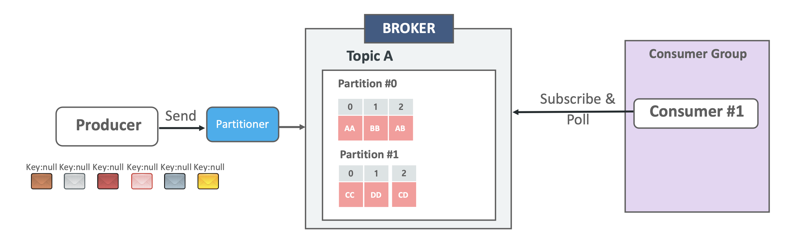

### Key값을 가지는 메시지 전송

- 메시지 Key는 업무 로직이나 메시지 Produce/Consume 시 분산 성능 영향을 고려하여 생성한다.
- 특정 Key값을 가지는 메시지는 **특정 파티션으로 고정되어 전송**된다.
    - 카프카는 하나의 파티션 내에서만 메시지의 순서를 보장하기 때문에 같은 Key값을 가지는 메시지는 순서를 보장할 수 있게끔 되어진다.
    - 예를들어 Key=01인 메시지는 파티션 0으로만 보내지게 되고, Key=02인 메시지는 파티션 1으로만 보내지게 된다.
- 요약하자면 특정 Key값을 가지는 메시지는 단일 파티션 내에서 전송 순서가 보장되어 Consumer에게 읽혀진다.

**console에서 key값을 지정해서 전송하는 법**

1. console producer 접속
```shell
kafka-console-producer --bootstrap-server localhost:9092 --topic  {토픽명} --property key.separator=: --property parse.key=true
```
2. key값을 붙여서 메시지 전송
```shell
>{Key}:{Value}
```

**console consumer에서 partition,key,value를 보는법**

```shell
kafka-console-consumer --bootstrap-server localhost:9092 --topic {토픽명} --from-beginning --property print.key=true --property print.value=true --property print.partition=true
```

### Key값을 가지지 않는 메시지 전송시 파티션 분배 전략

- 라운드 로빈(Round Robin): Kafka 2.4버전 이전 기본 파티션 분배 전략
    - 최대한 메시지를 파티션에 균일하게 분배하려는 전략으로, 메시지 배치를 순차적으로 다른 파티션으로 전송한다.
    - 메시지가 **배치 데이터를 빨리 채우지 못하면서 전송이 늦어지거나**, **배치를 다 채우지 못하고 전송하면서 전송 성능이 떨어지는 문제**가 발생한다.
    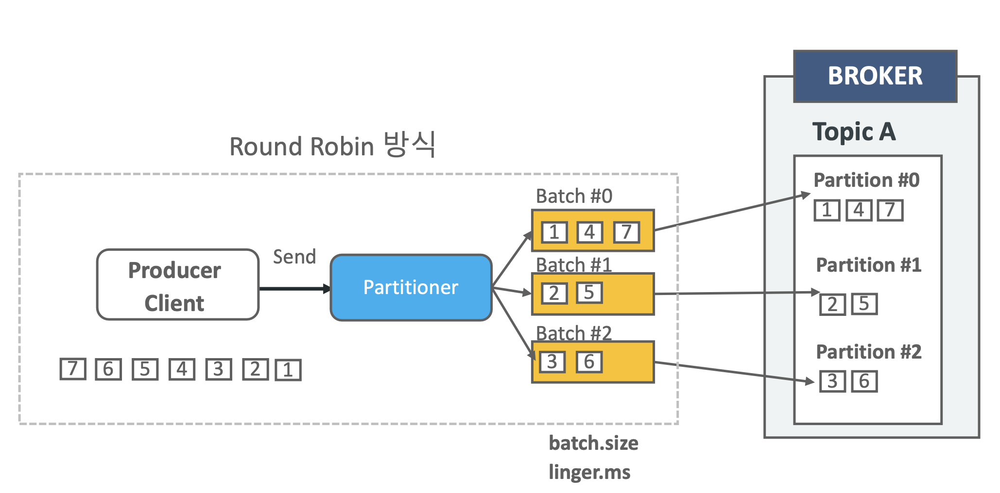
- 스티키 파티셔닝(Sticky Partitioning): Kafka 2.4 버전부터 기본 파티션 분배 전략
    - 라운드 로빈의 성능을 개선하고자 **특정 파티션으로 전송되는 하나의 배치에 메시지를 빠르게 먼저 채워서 보내는 방식**이다.
    - 배치를 채우지 못하고 전송을 하거나 배치를 채우는데 시간이 너무 오래 걸리는 문제를 개선하였다.

### Consumer Group & Consumer

- 모든 Consumer들은 **단 하나의 Consumer Group에 소속**되어야 하며, **Consumer Group은 1개 이상의 Consumer를 가질 수 있다.**
- Partition의 Record들은 단 하나의 Consumer에만 할당된다.
- Kafka의 병렬도를 좌지우지하는 것은 Partition이다. 즉, Partition의 개수에 의해서 병렬도가 결정된다. 하지만 하나의 Consumer Group에 Consumer가 1개라면 수많은 Partition은 의미가 없다. 따라서 보통은 Partition의 개수와 Consumer의 개수를 맞춰서 설계한다. 
- Partition 대비 Consumer 비율의 예시는 다음과 같다.
    - 첫 번째 예시는 Consumer가 그룹 내에 하나인 경우이다.
        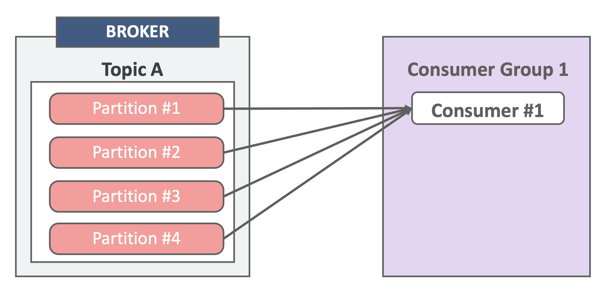
        - 이 경우는 수많은 파티션을 처리할 Consumer가 하나밖에 없기 때문에 Consumer에 병목현상이 일어날 수 있다.
    - 두 번째 예시는 Consumer가 그룹 내에 두개인 경우이다.
        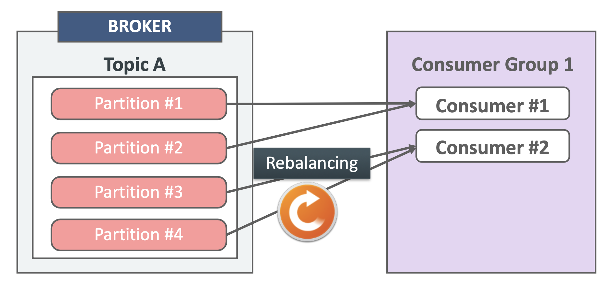
        - 이 경우는 전의 경우보다는 처리할 Consumer가 하나 더 있기 때문에 조금 나은 경우이다.
        - 또한 이 경우는 Consumer Group 내에 Consumer 변화가 있을 때마다 Partition과 Consumer의 조합을 변경하는 Rebalancing이 발생한다.
        - 예를들어 Consumer #1이 Partition 4개를 혼자 담당했다가 Consumer #2가 들어오면 Rebalancing을 통해서 처리할 Partition을 나눠갖는 것이다.
    - 세 번째 예시는 그룹 내의 Consumer의 개수가 처리할 Partition의 개수랑 동일한 경우이다.
        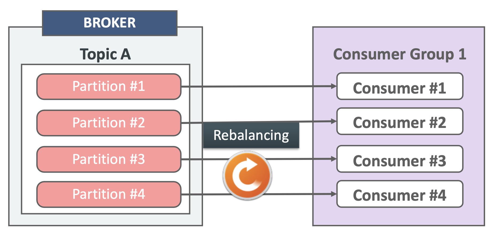
        - 이 경우가 가장 이상적인 경우라고 할 수 있다.
    - 네 번째 예시는 처리할 Partition의 개수보다 그룹 내의 Consumer가 더 많을 경우이다.
        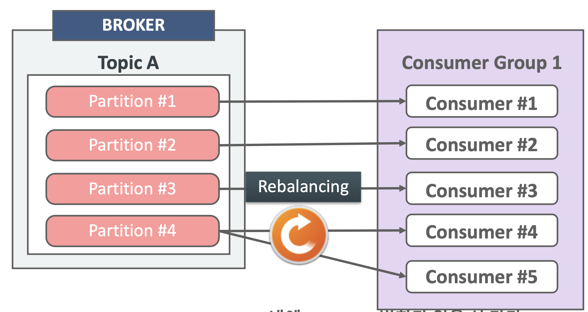
        - 이 경우도 Rebalancing이 일어나서 Partition #4를 Consumer #5가 처리할 수도 있지만, 특정 Partition을 하나의 그룹안에 있는 여러 개의 Consumer가 처리하지는 못한다.
    - 다섯 번째 예시는 하나의 토픽을 여러 개의 Consumer Group이 Subscribe 할 경우이다.
        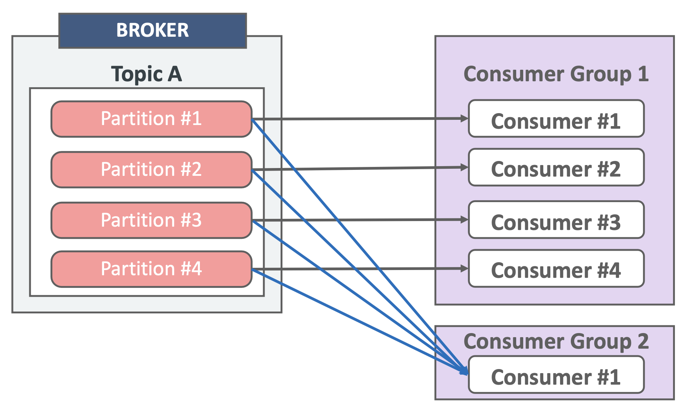
        - 이 경우에는 각각의 그룹마다 독립적으로 Consume하게 된다.
        - 즉, 동일한 Consumer Group내의 Consumer들은 작업량을 최대한 균등하게 분배하고, 서로 다른 Consumer Group의 Consumer들은 분리되어 독립적으로 동작한다.
