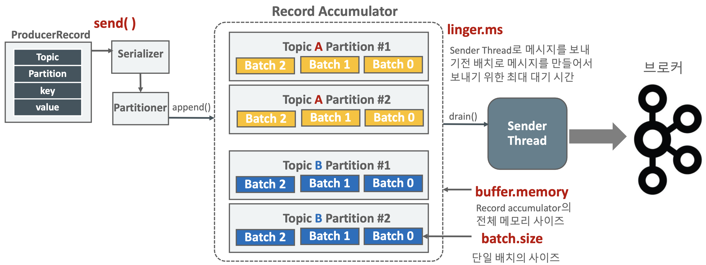

# Producer Core 개념

### Producer acks

- Producer는 해당 Topic의 Partition의 Leader Broker에게만 메시지를 보냄
- Broker들은 Leader Broker의 복제 메시지를 가지고 있다.

### acks == 0

- Producer는 Leader Broker가 메시지 A를 정상적으로 받았는지에 대한 **Ack 메시지를 받지 않고 다음 메시지인 B를 바로 전송**한다.
- 메시지가 제대로 전송되었는지 Broker로 부터 확인을 받지 않기 때문에 **메시지가 브로커에 기록되지 않더라도 재전송하지 않는다.**
- **메시지 손실의 우려가 가장 크지만** **가장 빠르게 전송**할 수 있다.(IoT 센서 데이터 등 데이터 손실에 민감하지 않은 데이터 전송에 활용)

### acks == 1

- Producer는 Leader Broker가 메시지 A를 정상적으로 받았는지에 대한 **Ack 메시지를 받은 후 다음 메시지인 메시지 B를 바로 전송** -> 만약 **오류** 메시지를 브로커로부터 받으면 메시지 A를 **재전송**한다.
- **메시지 A가 모든 Replicator에 완벽하게 복사되었는지의 여부는 확인하지 않고 메시지 B를 전송**
- 만약 **Leader가 메시지를 복제중에 다운될 경우 다음 Leader가 될 브로커에는 메시지가 없을 수 있기 때문에 메시지를 소실할 우려가 있음**

### acks == all

- Producer는 Leader Broker가 메시지 A를 정상적으로 받은 뒤 min.insync.replicas 개수 만큼의 **Replicator에 복제를 수행한 뒤**에 보내는 Ack 메시지를 받은 후 다음 메시지인 메시지 B를 바로 전송한다. 만약 **오류 메시지를 브로커로부터 받으면 메시지 A를 재전송**한다.
- 메시지 A가 **모든 Replicator에 완벽하게 복사되었는지의 여부까지 확인 후에 메시지 B를 전송**한다.
- 메시지 손실이 되지 않도록 모든 장애 상황을 감안한 전송 모드이지만, Ack를 오래 기다려야 하므로 상대적으로 **전송속도가 느리다.**

### Producer의 Sync와 Callback Async에서의 acks와 retry

- Callback 기반의 **async에서도 동일하게 acks 설정에 기반하여 retry가 수행**된다.
- Callback 기반의 async에서는 retry에 따라 producer의 원래 메시지 전송순서와 Broker에 기록되는 메시지 전송 순서가 변경될 수 있다.
- **Sync 방식에서 acks=0 일 경우 전송 후 ack/error를 기다리지 않는다.**(fire and forget)

# Producer Message batch send

- Producer가 메시지를 전송(send) 하면 바로 전송하는 것이 아니라 별도의 Sender Thread가 Batch 단위로 메시지를 전송하게 된다.
- 즉, Kafka Producer가 메시지를 전송하면 Serializer(메시지 직렬화) -> Partitioner(메시지가 들어갈 목적지(파티션)을 결정) -> Record Accumulator 저장 -> Sender에서 별도의 Thread로 전송을 수행한다.

좀 더 자세하게 말하자면, KafkaProducer 객체의 send() 메서드는 호출 시마다 하나의 ProducerRecord를 입력하지만 **바로 전송되지 않고 내부 메모리에서 단일 메시지를 Topic Partition에 따라서 Record Batch 단위로 묶인 뒤에 전송**된다.

메시지들은 Producer Client의 **내부 메모리에 여러 개의 Batch들로 buffer.memory(Record Accumulator의 크기) 설정 사이즈만큼 보관**될 수 있으며, 여러 개의 Batch들로 한꺼번에 전송될 수 있다.

### Kafka Producer Record Accumulator

- Record Accumulator는 **Partitioner에 의해서 메시지 배치가 전송이 될 토픽**과 **Partition에 따라 저장되는 KafkaProducer 메모리 영역**이다.
- Sender Thread는 Record Accumulator에 누적된 메시지 배치를 꺼내서 브로커로 전송한다.
- KafkaProducer의 Main Thread는 **send() 메서드를 호출**하고 **Record Accumulator에 데이터를 저장**하고 Sender Thread는 별개로 **데이터를 브로커로 전송**한다.

### Producer의 linger.ms와 batch.size

**linger.ms**

- Sender Thread로 메시지를 보내기전 배치로 메시지를 만들어서 보내기 위한 최대 **대기시간**을 의미한다.
- 즉, 배치들이 여러 개 쌓이면 보내기 위해서 대기하는 시간을 의미한다.

**batch.size**

- Sender Thread는 기본적으로 전송할 준비가 되어있으면 Record Accumulator에서 1개의 Batch를 가져갈수도, 여러 개의 Batch를 가져갈 수도 있다.
- 또한 **Batch에 메시지가 다 차지 않아도 가져갈 수 있다.**
- linger.ms를 0보다 크게 설정하여 Sender Thread가 하나의 Record Batch를 가져갈 때 **일정 시간 대기**하여 **Record Batch에 메시지를 보다 많이 채울 수 있도록 적용**한다.
    - 예를들어 프로듀서가 메시지를 보낼 때 조금 늦게 보낼 때, Batch 0 처럼 메시지가 많이 쌓이지 않았는데 Sender Thread가 Record Batch를 가져갈 수 있다. 이 처럼 Batch로 보내는 메시지를 효율적으로 처리하기 위해서 linger.ms를 0보다 크게 설정할 수 있다는 것이다.

### Producer의 linger.ms에 대한 고찰

- linger.ms를 반드시 0보다 크게 설정할 필요는 없다.
    - Producer와 Broker간의 전송이 매우 빠르고, Producer에서 메시지를 적절한 Record Accumulator에 누적된다면 linger.ms가 0이 되어도 무방하다.
    - 반면에 전반적인 Producer와 Broker간의 **전송이 느리다면 linger.ms를 높여서 메시지가 배치로 적용될 수 있는 확률을 높이는 시도를 해볼만 하다.**
- linger.ms는 **보통 20ms 이하로 설정을 권장**한다.

### Producer의 Sync와 Callback Async에서의 Batch

- 기본적으로 KafkaProducer 객체의 send() 메서드는 **비동기(Async)이며 Batch 기반으로 메시지를 전송**한다.
- Callback 기반의 Async는 비동기적으로 메시지를 보내면서 **RecordMetadata를 Client가 받을 수 있는 방식을 제공한**다.
- Callback 기반의 Async는 **여러 개의 메시지가 Batch로 만들어진다.**
- RecordMetadata recordMetadata = KafkaProducer.send().get()와 같은 방식으로 **개별 메시지 별로 응답을 받을 때까지 block이 되는 방식**으로는 **메시지 배치 처리가 불가능**하다. 전송은 배치레벨이지만 배치에 메시지는 단 1개이다.

### Producer의 메시지 전송/재전송 시간 파라미터 이해

- Producer는 메시지를 전송할 때 Broker가 응답이 없거나 에러가 발생하면 재전송하는 메커니즘이 있다.
- 이 중에 애초에 Record Accumulator에 메시지를 보내지 못하는 경우가 존재한다.
- Record Accumulator에 메시지가 꽉 차서 Producer가 send()로 Record Accumulator에 못 넣는 경우도 이에 속한다.
    - Record Accumulator가 꽉차는 경우를 예상해서 max.block.ms 값 만큼 대기하다가 Record Accumulator에서 메시지를 Sender Thread가 가져가서 비워지기를 기다린다. 하지만 max.block.ms 만큼 대기를 했는데도 Record Accumulator가 비워지지 않는다면 예외를 던지게 된다.
    - 즉, max.block.ms는 Producer가 send() 호출 시 Record Accumulator에 입력하지 못하고 block되는 최대 시간을 의미한다. 이를 초과하면 Timeout Exception이 발생한다.
- 결국 대기 후 Producer가 send()를 해서 Sender Thread가 이를 받아서 Broker에게 메시지를 전송 하였는데, ERROR 또는 응답이 없으면 또한 예외가 발생한다. 
    - request.timeout.ms 값 만큼 대기를 하고 초과하면 예외가 발생한다. 이 request.timeout.ms 는 전송에 걸리는 최대 시간을 의미하고, 전송 재시도 대기시간을 제외하고 초과할 시에는 재시도를 하거나 Timeout Exception이 발생한다.
- 즉, Producer는 설정정보중에 이 모든걸 포함하는 **delivery.timeout.ms** 값 만큼 재전송을 계속하다가 종료를 하게된다.
    - delivery.timeout.ms >= linger.ms + request.timeout.ms

### Producer의 메시지 재전송 - retries & delivery.timeout.ms

- retries와 delivery.timeout.ms를 이용하여 재전송 횟수를 조정한다.
- retries는 재전송 횟수를 설정하는 파라미터이다.
- delivery.timeout.ms는 메시지 재전송을 멈출때까지의 시간을 의미한다.
- 보통 retries는 무한대값으로 설정하고 delivery.timeout.ms(기본 120000, 2분)를 조정하는 것을 권장한다.
- 이는 왜냐하면 retries 설정 횟수만큼 재전송 시도하다가 결국에는 delivery.timeout.ms가 되면 재전송을 중지하기 때문이다.

