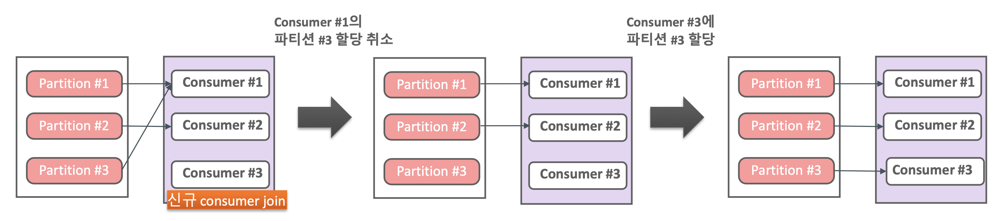

# Consumer 내부 메커니즘 이해

### Broker의 Group Coordinator와 Consumer/Consumer Group

#### Rebalancing

Consumer Group내에 **새로운 Consumer가 추가**되거나 **기존 Consumer가 종료**될 때, 또는 **Topic에 새로운 Partition이 추가될 때** Broker의 Group Coordinator는 Consumer Group내의 Consumer들에게 파티션을 다시 할당하는 Rebalancing을 수행하도록 지시한다.

다음은 Rebalancing 하는 과정에 대해서 순서대로 나열한 것이다.

1. Consumer Group내의 Consumer가 브로커에 최초 접속 요청 시 Group Coordinator를 생성한다.
2. 동일 group.id로 여러 개의 Consumer로 Broker의 Group Coordinator로 접속한다.
3. **가장 빨리** Group에 Join 요청을 한 Consumer에게 Consumer Group내의 **Leader Consumer로 지정**한다.
4. Leader로 지정된 Consumer는 파티션 할당 전략에 따라서 **Consumer들에게 파티션을 할당**한다.
5. Leader Consumer는 최종 할당된 파티션 정보를 Group Coordinator에게 전달한다. 즉, 보고한다는 뜻이다.
6. 정보 전달 성공을 공유한 뒤 개별 Consumer들은 할당된 파티션에서 메시지를 읽는다.

#### Consumer Static Group Membership

##### 개요

- 많은 Consumer를 가지는 Consumer Group에서 Rebalance가 발생하면 **모든 Consumer들이 Rebalance를 수행하므로 많은 시간이 소모되고 대량 데이터 처리 시 Lag이 더 길어질 수 있다.**
- 유지보수 차원의 Consumer Restart도 Rebalance를 초래하므로 **불필요한 Rebalance를 발생시키지 않을 방법을 찾아야 할 것**이다.

##### Static Group Membership

- Consumer Group내의 **Consumer들에게 고정된 id를 부여**하는 것이다.
- Consumer별로 Consumer Group 최초 조인 시 할당된 파티션을 그대로 유지하고, Consumer가 shutdown되어도 `session.timeout.ms`내에 **재기동되면 rebalance가 수행되지 않고 기존 파티션이 재 할당**된다.
- `session.timeout.ms` 의 디폴트값은 45초이다.

#### Heart Beat Thread

- Heart Beat Thread를 통해서 브로커의 Group Coordinator에 **Consumer의 상태를 전송**한다.
- Heart Beat과 poll()관련 주요 Consumer 파라미터는 다음과 같다.
- `heartbeat.interval.ms`
	- Heart Beat Thread가 **Heart Beat를 보내는 간격**이다.
	- `session.timeout.ms` 보다 낮게 설정되어야 한다. Session.timeout.ms의 1/3보다 낮게 설정을 권장한다.
	- 기본값은 3000ms이다.
- `session.timeout.ms`
	- 브로커가 Consumer로 **Heart Beat를 기다리는 최대 시간**을 의미한다.
	- 브로커는 이 시간동안 Heart Beat를 Consumer로 부터 받지 못하면 해당 Consumer를 Group에서 제외하도록 rebalancing 명령을 지시한다.
	- 기본값은 45000ms이다.
- `max.poll.interval.ms`
	- 이전 poll() 호출 후 **다음 호출 poll()까지 브로커가 기다리는 시간**을 의미한다.
	- 해당 시간동안 poll() 호출이 Consumer로부터 이뤄지지 않으면 **해당 Consumer는 문제가 있는 것으로 판단하고 브로커는 rebalance 명령**을 보낸다.
	- 기본값은 300000ms이다.
### Consumer에 Rebalance가 발생하는 상황

- Consumer Group내에 **새로운 Consumer가 추가**되거나 **기존 Consumer가 종료**될 때, 또는 Topic에 **새로운 Partition이 추가**될 때
- `session.timeout.ms` 이내에 Heartbeat이 응답이 없거나, `max.poll.interval.ms` 이내에 poll() 메서드가 호출되지 않을 경우

#### Consumer Rebalancing Protocol - Eager 모드

- Consumer가 기본으로 사용하고 있는 모드이다.
- **Rebalance 수행 시 기존 Consumer들의 모든 파티션 할당을 취소하고 잠시 메시지를 읽지 않음**. 이후 새롭게 Consumer에 파티션을 다시 할당받고 다시 메시지를 읽음
- 모든 Consumer가 **잠시 메시지를 읽지 않는 시간으로 인해 Lag이 상대적으로 크게 발생할 가능성이 있다.**

#### Consumer Rebalancing Protocol - (Incremental) Cooperative 모드

- Rebalance 수행 시 **기존 Consumer 들의 모든 파티션 할당을 취소하지 않고** 대상이 되는 Consumer들에 대해서 파티션에 따라 **점진적으로(Incremental) Consumer를 할당**하면서 Rebalance를 수행한다.
- 전체 Consumer가 메시지 읽기를 중지하지 않으며 개별 Consumer가 협력적으로(Cooperative) 영향을 받는 파티션만 Rebalance로 재분배를 한다. **많은 Consumer를 가지는 Consumer Group내에서 Rebalance 시간이 오래 걸릴 시 활용도가 높다.**

### Consumer 파티션 할당 전략

Consumer의 부하를 파티션별로 균등하게 할당하는 것이 목표이다.
데이터 처리 및 리밸런싱의 효율성을 극대화하는것이 목표이다.

##### 유형

- Range 할당 전략
	- Kafka에서 현재 기본값으로 사용하고 있는 전략이다.
	- 서로 다른 2개 이상의 토픽을 Consumer들이 Subscription 할 시 **토픽별 동일한 파티션을 특정 Consumer에게 할당**하는 전략이다.
	- 여러 토픽들에서 동일한 키 값으로 되어있는 파티션은 특정 Consumer에 할당하여 해당 Consumer가 여러 토픽의 동일한 키 값으로 데이터 처리를 용이하게 할 수 있도록 지원한다.
- Round Robin 할당 전략
	- 파티션별로 Consumer들이 **균등하게 부하를 분배**할 수 있도록 여러 토픽들의 파티션들을 Consumer들에게 순차적인 Round robin 방식으로 할당한다.
- Sticky 할당 전략
	- 최초에 할당된 **파티션과 Consumer 매핑을 Rebalance 수행되어도 가급적 그대로 유지**할 수 있도록 지원하는 전략이다.
	- 하지만 Eager Protocol 기반이므로 **Rebalance 시 모든 Consumer의 파티션 매핑이 해제된 후에 다시 매핑**되는 형태이다.
- Cooperative(협력적) Sticky 할당 전략
	- Kafka에서 Range를 기본 전략으로 사용하지만 Range 전략이 문제가 생기면 이 전략이 기본으로 사용된다.
	- 최초에 할당된 파티션과 Consumer 매핑을 Rebalance 수행되어도 가급적 그대로 유지할 수 있도록 지원함과 동시에 Cooperative Protocol 기반으로 **Rebalance 시 모든 Consumer의 파티션 매핑이 해제되지 않고 Rebalance 연관된 파티션과 Consumer만 재매핑**된다.

#### Round Robin과 Range 비교

- `Round Robin`은 토픽들의 파티션별로 순차적으로 Consumer에게 할당하므로 파티션 매핑이 **Consumer별로 비교적 균일하게 할당**한다.
- `Range`는 서로 다른 토픽들의 동일한 파티션들을 같은 Consumer로 할당한다. **서로 다른 토픽에서 동일한 키 값을 가지는 파티션들은 같은 Consumer에서 처리할 수 있도록 유도**한다.

#### Round Robin의 Rebalancing 후 파티션 Consumer 매핑

- Round Robin의 경우 Rebalancing 시에도 토픽들의 파티션과 Consumer들을 균등하게 매핑하려고 하므로 Rebalance 이전의 파티션과 Consumer들의 매핑이 변경되기 쉽다.
- 그 이유는 Round Robin에서의 Rebalancing 시 일단 파티션에 매핑된 모든 Consumer들을 해제하고 다시 균일하게 매핑하려고 하기 때문에 매핑된 파티션-컨슈머가 달라질 수 있다.

#### Sticky의 Rebalancing 후 파티션 Consumer 매핑

- Rebalancing 시 **기존 토픽들의 파티션과 Consumer 매핑은 최대한 유지**한다. **재할당되어야 하는 파티션들만 Consumer들에게 할당**한다.
- 하지만 모든 Consumer들의 파티션이 일제히 취소되는 `Eager Protocol` 기반에서 동작한다.
	- 즉, Rebalancing 시 모든 파티션-컨슈머 매핑이 해제된 후에 재할당된다는 의미이다.

#### Cooperative Sticky의 Rebalancing 후 파티션 Consumer 매핑

- Sticky와 유사하지만 모든 매핑을 다 취소하지 않는다.
	- 즉, Rebalancing 시 모든 파티션-컨슈머 매핑이 해제되지 않는다.
- **재할당되어야 할 파티션만 Consumer에 따라 순차적으로 Rebalance를 수행**하여 할당을 수행한다.
