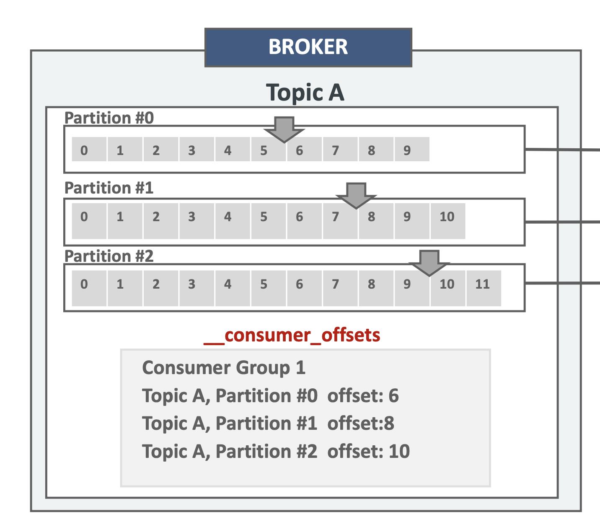
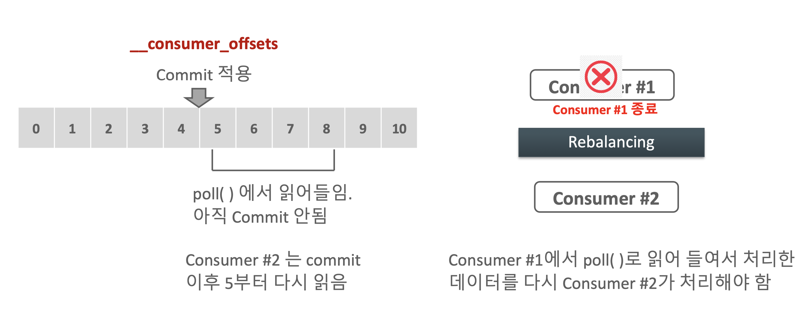
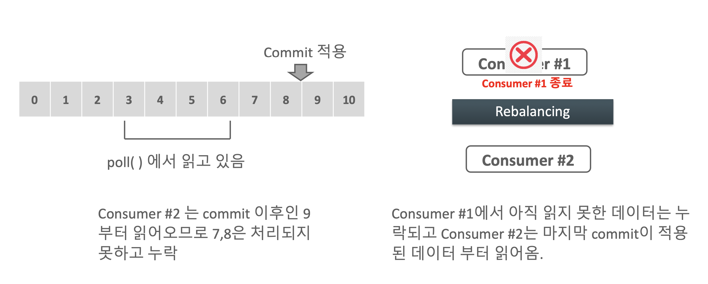

# Consumer 내부 메커니즘 이해 2

### Consumer의 subscribe, poll, commit 로직

- Consumer는 subscribe()를 호출하여 **읽어들이려는 토픽을 등록**한다.
- Consumer는 poll() 메서드를 이용하여 **주기적으로 브로커의 토픽 파티션에서 메시지를 가져온다.**
	- 메시지를 성공적으로 가져왔으면 `commit`을 통해서 `__consumer_offset` 에 **다음에 읽을 offset 위치를 기재**한다.

#### Offset Commit

- `__consumer_offsets`에는 Consumer Group이 **특정 topic의 파티션별로** 읽기 commit한 **offset 정보**를 가진다.
- **특정 파티션을 어느 consumer가 commit 했는지 정보를 가지지 않는다.**
	- 단순히 어느 토픽의 어느 오프셋을 읽을 차례인지가 `__consumer_offsets` 정보에 나타나있다.
	- 예를들어 `__consumer_offsets`이 'Topic A, Partition #2 offset: 10' 이라면 Consumer가 현재까지 'Topic A, Partition #2 offset: 9' 까지 읽고 commit 했다는 의미이다.
- 어떤 Consumer가 어떤 Partition을 읽고 있는지에 대한 정보는 Consumer Coordinator에서 Group Metadata에 저장되어 있다.



#### 중복(duplicate) 읽기상황



- 현재 offset #4 까지 읽었다고 가정한다.
- Consumer #1 이 offset #5 ~ #8 을 읽고있는 상황이고, 아직 commit하지 않은 상황이다.
	- 하지만 Consumer #1 은 비즈니스 로직을 실행하고 DB에 데이터를 넣은 상황이다.
	- 그런다음 kafka 에게 commit을 하는 와중에 다운된 것이다.
- 이 상황에서 Consumer #1 이 문제가 생겨서 다운되고 리밸런싱이 되어서 Consumer #2 이 offset #5 부터 다시 읽는다는 것이다.
- 이 때, 중복인 데이터를 다시 처리하고 데이터를 DB에 다시 넣는 행위를 하게될 수 있다.

#### 읽기 누락(loss) 상황



- 현재 Consumer #1 이 offset #3 ~ #6 을 읽고 있는 상황이고, #7, #8 은 처리하지 못한 상태로 #8 을 commit을 한 상황이다.
	- 즉, #3 ~ #6 은 읽어서 처리를 하고 commit을 한 상황이고
	- #7, #8 은 미리 commit을 하고 데이터를 처리하다가 consumer가 다운되어서 미처 처리를 못한 상황이다.
- 따라서 `__consumer_offsets`: #9 이므로 Consumer #2 는 offset #9 부터 읽고 처리하기 때문에 offset #7, #8 에 대해서는 누락(loss)이 발생하는 것이다.
#### Consumer의 auto commit

- Consumer의 파라미터로 auto.enable.commit=true 인 경우 읽어온 메시지를 브로커에 바로 commit 적용하지 않고, `auto.commit.interval.ms`에 **정해진 주기(기본 5초)마다 Consumer가 자동으로 commit을 수행**한다.
- Consumer가 읽어온 메시지보다 브로커의 Commit이 오래되었으므로 **Consumer의 장애/재기동 및 Rebalancing 후 브로커에서 이미 읽어온 메시지를 다시 읽어와서 중복처리될 수 있다.**

#### Consumer의 Manual 동기 / 비동기 Commit

- Consumer Client는 일정 주기마다 자동으로 Commit 하지 않고, API를 이용하여 동기 또는 비동기 Commit을 적용할 수 있다.

##### Sync(동기 방식)

- Consumer 객체의 `commitSync()` 메서드를 사용
- 메시지 배치를 poll()을 통해서 읽어오고 해당 메시지들의 마지막 offset을 브로커에 commit 적용
- 브로커에 **commit 적용이 성공적으로 될 때까지 블로킹을 적용**한다.
- **Commit 적용 완료 후에 다시 메시지를 읽어온다.**
- **브로커에 Commit 적용이 실패할 경우 다시 Commit 적용 요청**을 한다.
- 비동기 방식 대비 더 느린 수행시간

##### Async(비동기 방식)

- Consumer 객체의 commitAsync() 메서드를 사용
- 메시지 배치를 poll()을 통해서 읽어오고 해당 메시지들의 마지막 offset을 브로커에 commit 적용 요청하지만 브로커에 **commit 적용이 성공적으로 되었음을 기다리지 않고(블로킹 X) 계속 메시지를 읽어온다.**
- 브로커에 commit 적용이 실패해도 다시 commit 시도를 하지 않는다. 때문에 Consumer 장애 또는 **Rebalance 시 한번 읽은 메시지를 다시 중복해서 가져올 수 있다.**(동기 방식보다 중복해서 가져올 확률이 더 높음)
- 동기 방식 대비해서 더 빠른 수행시간을 갖는다.

#### Consumer에서 Topic의 특정 파티션만 할당하기

- Consumer에게 **여러 개의 파티션이 있는 Topic에서 특정 파티션만 할당이 가능**하다. **배치 처리 시** 특정 Key 레벨의 파티션을 특정 Consumer에 할당하여 처리할 경우 적용
- KafkaConsumer의 assign() 메서드에 TopicPartition 객체로 특정 파티션을 인자로 입력하여 할당한다.

```java
// topicName의 파티션 0번을 consumer에게 할당
TopicPartition topicPartition = new TopicPartition(topicName, 0);
kafkaConsumer.assign(Arrays.asList(topicPartition));
```

#### Consumer에서 Topic의 특정 파티션의 특정 offset 부터 읽기

- 특정 메시지가 누락되었을 경우 해당 메시지를 다시 읽어 오기 위해서 유지보수 차원에서 일반적으로 사용한다.
- TopicParitition 객체로 할당한 특정 파티션을 설정하고 seek() 메서드로 읽어올 offset을 설정한다.
- 이렇게 특정 offset부터 읽어오는 전략을 사용하면 주의할 점이 있다.
	- 기존 group id와 동일한 group id를 사용하면서 commit을 수행하면 `__consumer_offsets`을 재 갱신할 수 있으므로 유의가 필요하다.

```java
// topicName의 파티션 1번을 consumer에게 할당하고 offset #6번부터 읽어옴
TopicPartition topicPartition = new TopicPartition(topicName, 1);
kafkaConsumer.assign(Arrays.asList(topicPartition));
kafkaConsumer.seek(topicPartition, 6L);
```

