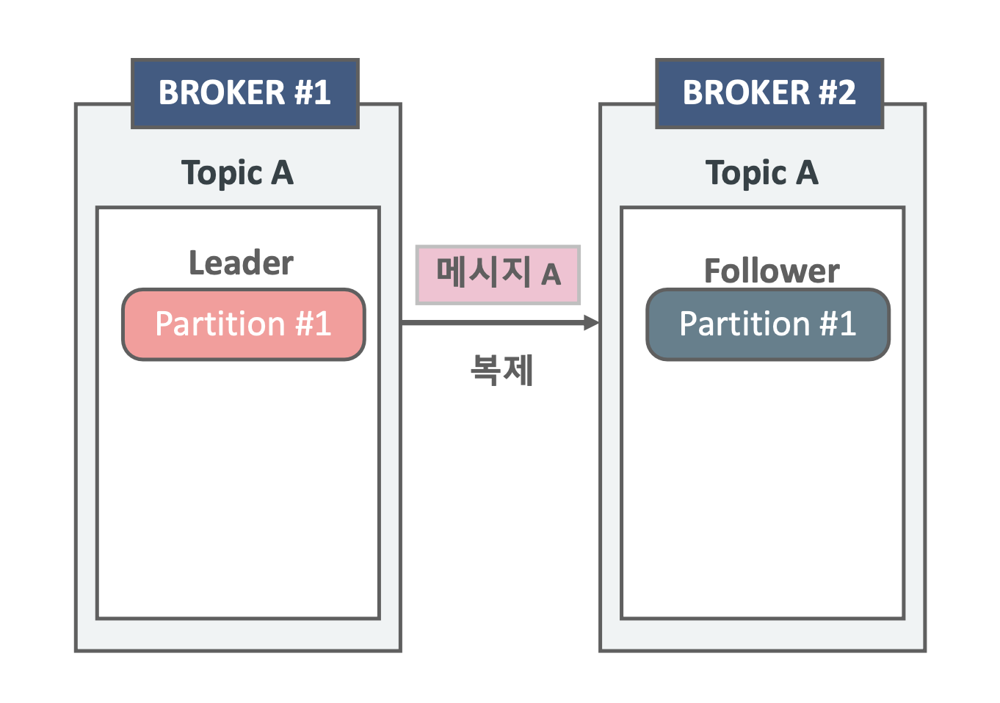
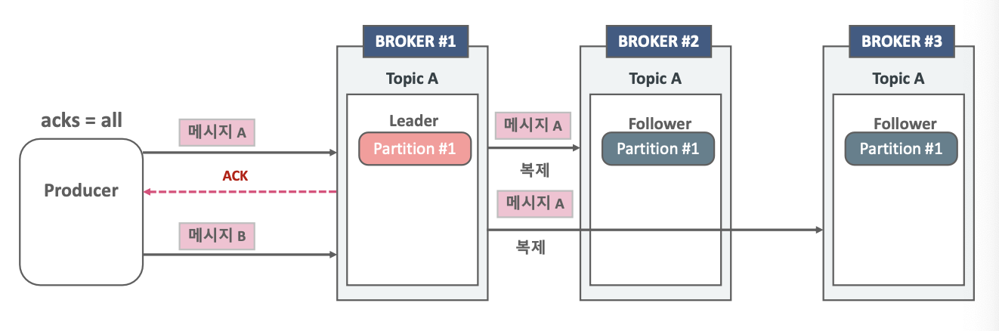
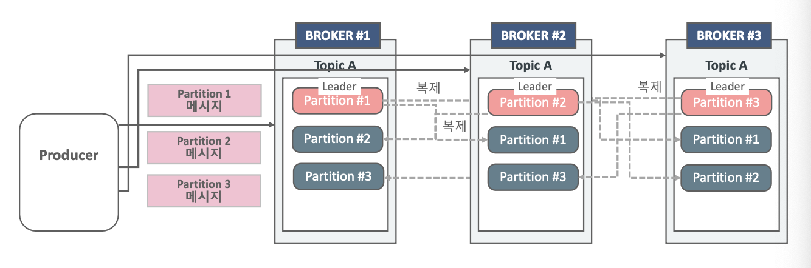
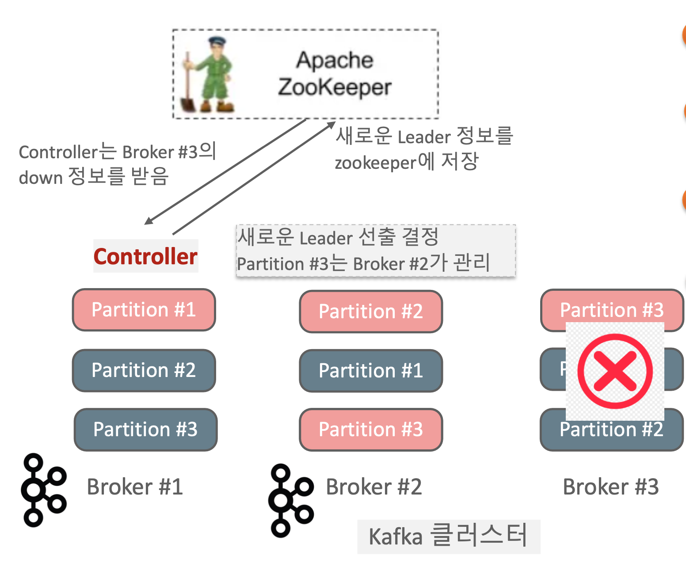
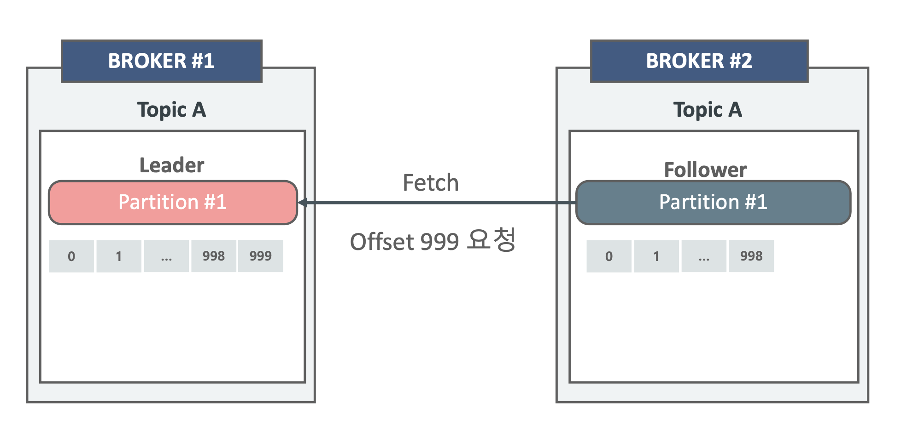
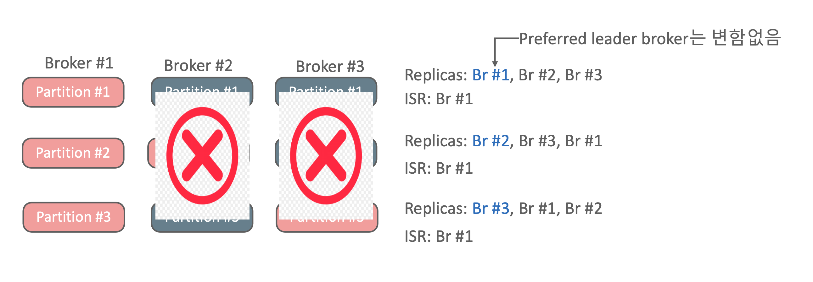
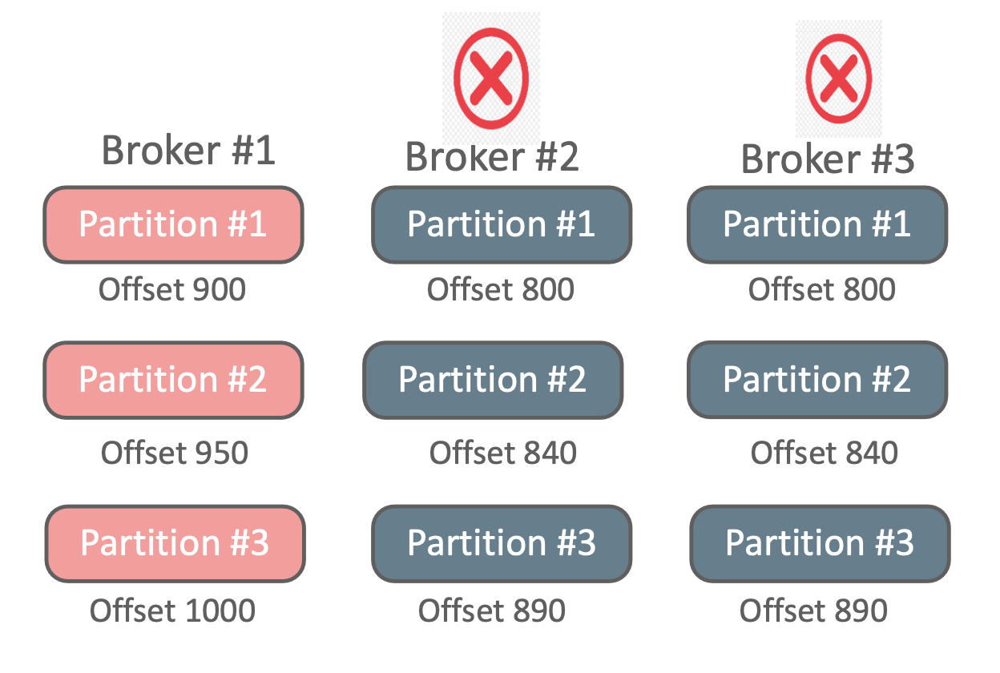

# 멀티 노드 카프카 클러스터

- **분산 시스템**으로서 카프카의 **성능과 가용성을 함께 향상**시킬 수 있도록 구성
- **스케일 아웃 기반**으로 노드 증설을 통해서 **카프카의 메시지 전송과 읽기 성능을 선형적으로 증가**시킬 수 있다.
- 데이터 복제(Replication)을 통해서 분산 시스템 기반에서 카프카의 최적 가용성을 보장한다.

### 분산 시스템 구성을 위한 중요 요소

- 분산 시스템 도입을 위해서는 **성능, 안정성, 가용성 측면에서 상세한 기능 검토가 요구**된다.
- 분산 시스템은 **대량 데이터를 여러 노드간 분산처리를 통해 빠르게 처리할 수 있는 큰 성능적 이점**을 가지지만, **안정성과 가용성 측면에서 상대적인 단점**을 가진다.

#### 단일 노드 구성(Scale Up)

처리하려는 데이터가 기하 급수적으로 늘어난다면?

- H/W를 CPU Core, Memory 용량, 디스크 용량, 네트웍 Bandwidth를 **Scale Up 방식으로 증설하기에는 한계**가 있다.(비용적인 측면이나, H/W 아키텍처 등)
- 단일 노드에 대해서만 가용성 구성을 강화하면 되므로 **매우 안정적인 시스템 구성이 가능**하다.
- 소프트웨어에서 **다양한 성능향상 기법을 도입하기 매우 쉽다.**

#### 다수의 노드로 분산 구성

- 개별 H/W 노드를 Scale Out 방식으로 증설하여 대용량 데이터 성능 처리를 선형적으로 향상
- 다수의 H/W가 1/N의 데이터를 처리하므로 이중 **한 개의 노드에서만 장애가 발생해도 올바른 데이터 처리가 되지 않는다.**
- **다수의 H/W로 구성하였으므로 빈번한 장애 가능성, 관리의 부담**
- 소프트웨어 자체에서 성능/가용성 처리 제약

### 멀티 노드 카프카 클러스터

- 분산 시스템으로서 카프카의 **성능과 가용성을 함께 향상** 시킬 수 있도록 구성
- 스케일 아웃 기반으로 **노드 증설을 통해 카프카의 메시지 전송과 읽기 성능을 (거의) 선형적으로 증가**시킬 수 있음
- 데이터 복제(Replication)을 통해 분산 시스템 기반에서 카프카의 최적 가용성을 보장한다.

### 카프카 Replication

- 카프카는 개별 노드의 장애를 대비하여 높은 가용성을 제공한다.
- 카프카 가용성의 핵심은 리플리케이션(Replication, 복제)
- Replication은 토픽 생성 시 **replication factor** 설정값을 통해 구성한다.
- Replication factor가 3이면 **원본 파티션과 복제 파티션을 포함하여 모두 3개의 파티션을 가짐을 의미**한다.
	- 각 브로커가 모두 3개의 파티션을 보유하고 있음을 의미한다.
- Replication factor의 개수는 **브로커의 개수보다 클 수 없다.**
	- 브로커의 개수보다 Replication Factor가 크다면 토픽 생성 시 오류가 발생한다.
- Replication의 동작은 토픽내의 개별 파티션들을 대상으로 적용한다.
- Replication factor의 대상인 파티션들은 1개의 Leader와 N개의 Follwer로 구성된다.

#### 카프카 Replication의 Leader와 Follwer

- Producer와 Consumer는 **Leader 파티션을 통해서 쓰기와 읽기를 수행**한다.
- 파티션의 Replication은 **Leader에서 Follwer으로만 이뤄진다.**
	- 실제로 Leader가 Follwer에게 주는것이 아닌 **Follwer가 Leader로부터 메시지를 가져와서 복제하는 메커니즘으로 구현**되어있다.
- 파티션 리더를 관리하는 브로커는 Producer/Consumer의 읽기/쓰기를 관리함과 동시에 파티션 팔로우를 관리하는 브로커의 Replication도 관리한다.

##### 단일 파티션의 Replication(복제)

- 파티션의 Replication은 **Leader에서 Follwer으로만 이루어진다.**
- 파티션 리더를 관리하는 브로커는 Producer/Consumer의 읽기/쓰기를 관리함과 동시에 파티션 팔로우를 관리하는 브로커의 Replication도 관리한다.

- 위 그림처럼 `acks=all` 이라고 가정하자.
- Producer가 메시지 A를 전달하면 무조건 Partition Leader가 있는 곳으로 쓰여진다. 따라서 Broker #1 에 메시지 A가 쓰여진다.
- Follower Partition이 존재하는 Broker #1, #2 는 이를 인지하고 Partition Leader에 쓰여진 메시지 A를 가복제해서 가져와 자신의 Follower Partition에 메시지 복제본을 쓰게된다.
- Leader Partition과 Follower Partition 들에 메시지가 모두 쓰여진 것을 확인하고 Partition Leader를 보유한 Broker는 Producer에게 ACK 신호를 보내게된다.

##### 멀티 파티션의 Replication(복제)

- 파티션의 Replication은 Leader에서 Follower으로만 이루어진다. (Follower에서 Leader 파티션을 읽어간다.)
- 파티션 리더를 관리하는 브로커는 Producer/Consumer의 읽기/쓰기를 관리함과 동시에 파티션 팔로우를 관리하는 브로커의 Replication도 관리한다.

- 위 그림과 같이 해당 토픽은 파티션이 3개이고 replication-factor가 3이라고 가정하자.
- 메시지 1의 목적지는 Partition #1 이므로 해당 파티션이 Leader인 Broker #1 에게 메시지가 쓰여진다.
	- 그런 다음 Follower Partition이 존재하는 Broker #2, #3 의 Follower Partition #1 으로 복제가 되어진다.
- 메시지 2의 목적지는 Partition #2 이므로 해당 파티션이 Leader인 Broker #2 에게 메시지가 쓰여진다.
	- 그런 다음 Follower Partition이 존재하는 Broker #1, #3 의 Follower Partition #2 으로 복제가 되어진다.
- 메시지 3의 목적지는 Partition #3 이므로 해당 파티션이 Leader인 Broker #3 에게 메시지가 쓰여진다.
	- 그런 다음 Follower Partition이 존재하는 Broker #1, #2 의 Follower Partition #3 으로 복제가 되어진다.

#### Zookeeper

- 분산 시스템간의 정보를 **신속하게 공유**하기 위한 코디네이션 시스템
- 클러스터내 개별 노드의 중요한 상태 정보를 관리하며 분산 시스템에서 **리더 노드를 선출하는 역할**들을 수행한다.
- 개별 **노드간 상태 정보의 동기화를 위한 복잡한 Lock 관리 기능을 제공**한다.
- 간편한 **디렉토리 구조 기반의 Z Node를 활용**한다.
- Z Node는 **개별 노드(카프카 브로커)의 중요 정보**를 담고 있다.
- 개별 노드(카프카 브로커)들은 Zookeeper의 Z Node를 계속 모니터링하며 **Z Node에 변경 발생 시 Watch Event가 트리거 되어 변경 정보가 개별 노드들에 통보**한다.
- Zookeeper 자체의 클러스터링 기능 제공한다.

##### Kafka 클러스터에서 Zookeeper의 역할

- Controller Broker 선출을 한다.(Controller는 여러 브로커들에서 파티션 Leader 선출을 수행한다.)
- Kafka 클러스터 내 Broker의 Membership 관리한다.(클러스터의 Broker들의 List, Broker Join/Leave 관리 및 통보)
- Topic 정보(Topic의 파티션, replicas등의)를 가진다.

##### Zookeeper에서 Kafka Cluster 정보 관리

- 모든 카프카 브로커는 **주기적으로 Zookeeper에 접속하면서 Session Heartbeat을 전송**하여 자신의 상태를 보고한다.
- Zookeeper는 `zookeeper.session.timeout.ms` 이내에 Heartbeat을 받지 못하면 **해당 브로커의 노드 정보를 삭제하고 Controller 노드에게 변경 사실을 통보**한다.
- Controller 노드는 다운된 브로커가 관리하는 파티션들에 대해서 **새로운 파티션 Leader Election을 수행**한다.
- 만일 **다운된 브로커가 Controller이면 모든 노드에게 해당 사실을 통보하고 가장 먼저 접속한 다른 브로커가 Controller가 된다.**

**요약**

- Zookeeper에 **가장 처음 접속을 요청한 Broker가 Controller**가 된다.
- Controller는 **파티션에 대한 Leader Election을 수행**한다.
- Controller는 Zookeeper로 부터 broker 추가/다운 등의 정보를 받으면 **해당 broker로 인해 영향을 받는 파티션들에 대해서 새로운 Leader Election을 수행**한다.

#### Controller의 Leader Election 수행 프로세스

1. Broker #3 이 Shutdown되고 Zookeeper는 session 기간동안 Heartbeat가 오지 않으므로 해당 브로커 노드 정보를 갱신
2. Controller는 Zookeeper를 모니터링 하던 중 **Watch Event로 Broker #3 에 대한 Down 정보를 받는다.**
3. Controller는 다운된 브로커가 관리하던 파티션들에 대해 새로운 Leader/Follower를 결정한다.
4. 결정된 **새로운 Leader/Follower 정보를 Zookeeper에 저장**하고 **해당 파티션을 복제하는 모든 브로커들에게 새로운 Leader/Follower 정보를 전달하고 새로운 Leader로부터 복제를 수행할 것을 요청**한다.
5. Controller는 모든 브로커가 가지는 Metadatacache를 새로운 Leader/Follower 정보로 갱신할 것을 요청한다.

#### ISR(In-Sync Replicas)

- Follower들은 누구라도 Leader가 될 수 있지만, 단 ISR 내에 있는 Follower들만 가능하다.
- 파티션의 Leader 브로커는 **Follower 파티션의 브로커들이 Leader가 될 수 있는지 지속적으로 모니터링** 수행하여 ISR을 관리한다.
- Leader 파티션의 메시지를 **Follower가 빠르게 복제하지 못하고 뒤쳐질 경우 ISR에서 해당 Follower는 제거**되며 **Leader가 문제가 생길 때 차기 Leader가 될 수 없다.**

##### ISR 조건

- 브로커가 **Zookeeper에 연결되어 있어야 한다.** zookeeper.session.timeout.ms 로 지정된 기간(기본 6초, 최대 18초)내에 Heartbeat를 지속적으로 Zookeeper로 보낸다.
	- 브로커가 자신이 살아있음을 알리는 Heartbeat를 Zookeeper로 보낸다.
- replica.lag.time.max.ms로 지정된 기간(기본 10초, 최대 30초)내에 Leader의 메시지를 지속적으로 가져가야 한다.
	- Follower가 Leader의 메시지를 지속적으로 가져가야 한다.
	- 즉, 10초안에 lag이 생기면 브로커가 죽었다고 판단하고 ISR 그룹에서 제거하게 된다.

###### 예시

- Follower는 Leader에게 Fetch 요청을 수행한다. Fetch 요청에는 Follower가 다음에 읽을 메시지의 offset 번호를 포함한다.
- Leader는 Follower가 요청한 offset 번호와 현재 Leader partition의 가장 최신 offset 번호를 비교하여 Follower가 얼마나 Leader 데이터 복제를 잘 수행하고 있는지를 판단한다.

#### min.insync.replicas

min.insync.replicas 파라미터는 **브로커의 설정값으로 Producer가 acks=all로 성공적으로 메시지를 보낼 수 있는 최소한의 ISR 브로커 개수**를 의미한다.

##### Producer의 acks 설정에 따른 send 방식 - acks all

- Producer는 Leader Broker가 메시지 A를 정상적으로 받은 뒤 모든 Replicator에 복제를 수행한 뒤에 보내는 ack 메시지를 받은 후 다음 메시지인 메시지 B를 바로 전송한다. 만약 오류 메시지를 브로커로부터 받으면 메시지 A를 재 전송한다.
- 메시지 A가 모든 Replicator에 완벽하게 복사되었는지의 여부까지 확인 후에 메시지 B를 전송한다.
	- 실제로는 min.insync.replicas 값 만큼 복사가 된다면 replicator에 완벽하게 복제되었다고 판단한다.
	- 즉, min.insync.replicas = 2이면 leader브로커 1개 follower브로커 1개까지 메시지가 전달되면 성공이라고 판단한다.
	- 만약 다른 follower브로커가 다운되고 leader만 남았다면 min.insync.replicas개수보다 적게 메시지가 전달되므로 error가 발생한다.
- 메시지 손실이 되지 않도록 감안한 전송 모드이지만 ack를 오래 기다려야 하므로 상대적으로 전송속도가 느리다.

#### Prefered Leader Election

- 파티션별로 **최초 할당된 Leader/Follower Broker 설정을 Preferred Broker로 그대로 유지**한다.
- Broker가 **shutdown 후 재기동 될 때 Preferred Leader Broker를 일정 시간 이후에 재 선출**한다.
- auto.leader.rebalance.enable=true로 설정하고 leader.imbalance.check.interval.seconds를 일정 시간으로 설정한다.(기본 300초)

##### Preferred Leader Election과 Unclean Leader Election

- Broker #2, #3 가 모두 shutdown 되면 Partition #1, #2, #3 의 Leader Broker는 Broker #1 이 된다.
- Broker #1 에 메시지가 추가로 계속 유입된 후 Broker #1 까지 shutdown 될 경우 이후 Broker #2, #3 이 재기동되어도 Partition #1, #2, #3 의 Leader Broker가 될 수 없다.
	- 이 때, Broker #2, #3 중에 하나만 다시 떠도 Leader가 되지 않는다.

##### Unclean Leader Election

- 기존의 Leader 브로커가 오랜 기간 살아나지 않을 경우 복제가 완료되지 않은(Out of sync) Follower Broker가 Leader가 될 지 결정해야 한다.
- 이 때, 기존의 Leader 브로커가 가진 메시지 손실 여부를 감수하고 복제가 완료되지 않은 Follower Broker가 Leader가 되려면 unclean.leader.election.enable=true로 설정하고 Unclean leader election을 수행한다.

