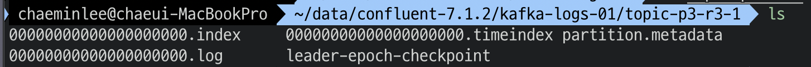
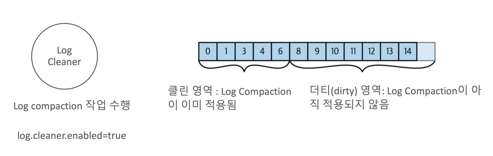
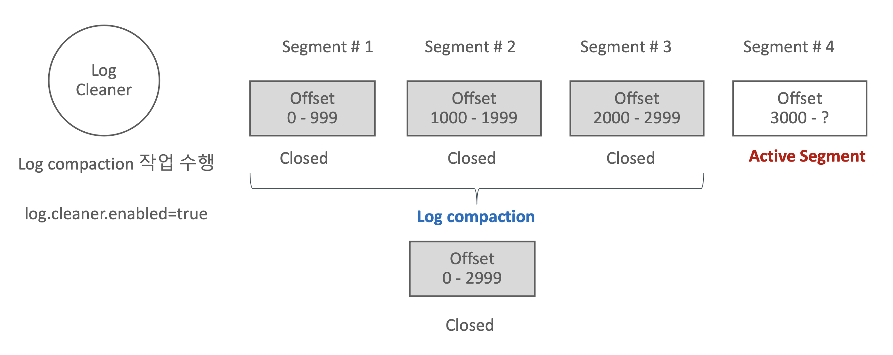

### 카프카 로그의 파티션과 세그먼트

- 카프카의 로그 메시지는 실제로는 segment로 저장이 된다.
- 파티션은 **단순히 파일 디렉토리**로만 되어있고, **해당 파티션 디렉토리에 메시지 저장 segment를 file로 가지고 있다.**
- 파티션은 여러 개의 segment로 구성되며 개별 segment는 데이터 용량이 차거나 **일정 시간이 경과하면 close되고 새로운 segment를 생성하여 데이터를 연속적으로 저장**한다.
- Segment는 close되면 더 이상 브로커가 write하지 않으며 read-only가 된다. 브로커는 여러 개의 segment 중 **단 하나의 active segment에만 write와 read를 수행**한다. 하나의 파티션은 단 하나의 active segment를 가진다.

##### Segment 저장 크기와 roll 관련 설정

- log.segment.bytes
	- 개별 segment의 최대 크기이며 **기본값은 1GB**
	- 지정된 크기를 넘기면 해당 segment는 더 이상 active segment가 아니고 close된다.(**write는 안되고 read만 된다.**)
	- Topic Config는 `segment.bytes`이며 기본값은 log.segment.bytes 설정을 따른다.
		- 즉, Topic 레벨의 설정은 segment.bytes이고, 전체 설정은 log.segment.bytes이다.
- log.roll.hours(ms)
	- 개별 segment가 유지되는 **(roll 수행되기 전) 최대 시간**이며 기본값은 7일이다.
	- 지정된 **시간을 넘기면 해당 segment는 더 이상 active segment가 아니고 close된다**.(write는 안되고 read만 된다.)
	- log.segment.bytes에 지정된 크기만큼 차지 않아도 **log.roll.ms 만큼의 시간이 지나면 해당 segment를 close 한다.**
	- Topic Config는 `segment.ms` 이며 기본값은 log.roll.hours 설정을 따른다.
		- 즉, Topic 레벨의 설정은 segment.ms이고, 전체 설정은 log.roll.hours이다.

##### 파티션 디렉토리내의 Segment와 Index 파일 구성

- Topic을 생성하면 파티션 디렉토리내에 메시지 내용을 가지는 segment와 offset의 위치 byte 정보를 가지는 Index 파일, record 생성 시간에 따른 위치 byte 정보를 가지는 timeindex 파일로 구성된다.

- .log : 메시지 정보가 들어간다.
- .index : 오프셋에 대한 바이트 위치가 들어간다.

##### 메시지 로그 Segment와 Index, TimeIndex

- Index 파일은 **offset 별로 byte position 정보**를 가지고 있다. 메시지 Segment는 File 기반이므로 특정 offset의 데이터를 파일에서 읽기 위해서는 **시작 File Pointer에서 얼마만큼의 byte에 위치해 있는지 알아야 한다.**
- Index 파일은 모든 offset에 대한 byte position 정보를 가지고 있지 않으며 log.index.interval.bytes에 설정된 값 만큼의 segment bytes가 만들어질 때마다 해당 offset에 대한 byte position 정보를 기록한다.
- Timeindex 파일은 메시지의 **생성 Unix 시간을 밀리 세컨드 단위**로 가지고 있고, **해당 생성 시간에 해당하는 offset 정보를 가진다.**

#### Log Cleanup Policy

- 카프카 브로커는 오래된 메시지를 관리하기 위한 정책을 log.cleanup.polic로 설정한다.(Topic 레벨은 cleanup.policy)
- log.cleanup.policy = **delete**로 설정하면 segment를 `log.retention.hours`나 `log.retention.bytes` **설정 값에 따라 삭제**한다.
- log.cleanup.policy = **compact**로 설정하면 segment를 **key 값 레벨로 가장 최신의 메시지만 유지**하도록 segment 재구성
- log.cleanup.policy = [delete, compact] 로 설정하면 compact와 delete를 함께 적용한다.

##### Log.cleanup.policy = delete 시 삭제를 위한 설정 파라미터

- log.retention.hours(ms)
	- 개별 Segment가 **삭제되기전 유지하는 시간**. 기본은 **일주일(168시간)**
	- 크게 설정하면 오래된 segment를 그대로 유지하므로 디스크 공간이 더 필요하다. 작게 설정하면 오래된 segment를 조회할 수 없다.
	- Topic Config는 `retention.ms` 이며 기본값은 `log.retention.hours`를 따른다.
- log.retention.bytes
	- Segment **삭제 조건이 되는 파티션 단위의 전체 파일의 크기**를 설정한다. **기본값은 -1로 무한대**이다.
	- 적정한 **디스크 공간 사용량을 제약하기 위해서 보통 설정**한다.
	- Topic Config는 `retention.bytes`이며 기본값은 `log.retention.bytes`를 따른다.
- log.retention.check.interval.ms
	- 브로커가 background로 **Segment 삭제 대상을 찾기 위한 ms 단위의 주기**이다.
	- 기본값은 5분이다.

#### Log Compaction

- log.cleanup.policy=compact로 설정 시 Segment의 key값에 따라 **가장 최신의 메시지로만 compact하게 segment를 재구성**한다.
- Key값이 **null인 메시지에는 적용할 수 없다.**
- 백그라운드 스레드 방식으로 별도의 I/O 작업을 수행하므로 **추가적인 I/O 부하가 소모**된다.

##### Log Compaction 수행

- Active Segment는 Compact 대상에서 제외한다.
- Compaction은 **파티션 레벨에서 수행이 결정**되며, **개별 세그먼트들을 새로운 세그먼트들로 재생성**함

##### Log Compaction 수행 후에는

- 메시지의 **순서는 여전히 유지**한다.
- 메시지의 **offset은 변하지 않는다.**
- Consumer는 (**Active Segment를 제외하고) 메시지의 가장 최신값을 읽는다.**(단 Compact 기반으로 로그가 재생될 시 키 값은 있지만 Value가 null 값을 가지는 메시지는 일정 시간 이후에 삭제되기 때문에 읽지 못할 수 있다.)

##### Log Compaction은 언제 수행되는가?

- Dirty 비율이 `log.cleaner.min.cleanable.ratio` 이상이고 메시지가 생성된 지 `log.cleaner.min.compaction.lag.ms` 이 지난 Dirty 메시지에 수행한다.
- 메시지가 생성된지 `log.cleaner.max.compaction.lag.ms` 이 지난 Dirty 메시지에 수행한다.
